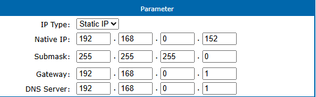
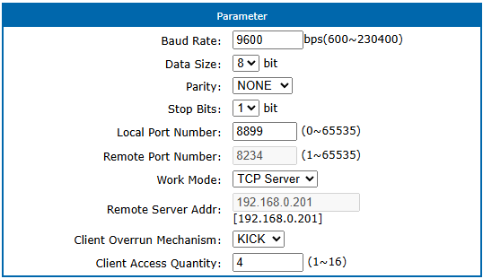
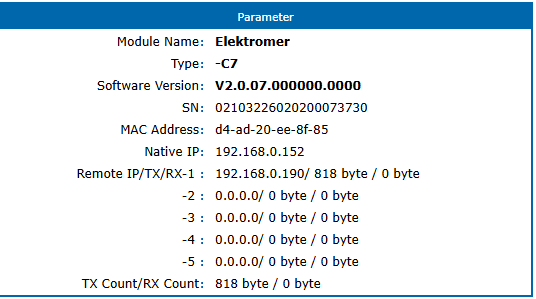
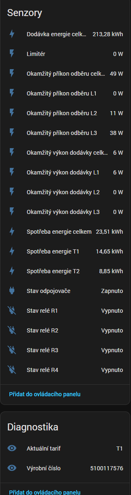

# XT211 HAN – Home Assistant Integration

[](https://github.com/hacs/integration)


> Čtení dat z elektroměru Sagemcom XT211 / Relay box (ČEZ Distribuce) přes RS485-to-Ethernet převodník do Home Assistantu.

Tahle integrace čte push data z HAN / RS485 rozhraní elektroměru přes TCP server na převodníku. 

## Jak to funguje

```text
XT211 / Relay box
   └── RJ12 HAN port (RS485, 9600 Bd)
          └── RS485 → Ethernet převodník
                 └── TCP server na LAN
                        └── Home Assistant
```

- Elektroměr posílá jednosměrná DLMS/COSEM data z elektroměru k zákazníkovi rychlostí 9600 Bd a podle dokumentace ČEZ se push zprávy předávají 1× za 60 s. 
- Rozhraní je vyvedené na konektoru RJ12, kde je Data A na pinu 3, Data B na pinu 4 a GND na pinu 6. 
- Dokumentace také uvádí sadu OBIS kódů pro HAN rozhraní. 

## Ověřený hardware

Integrace byla ověřena s převodníkem z rodiny PUSR USR-DR132/USR-DR134. Výrobce na produktové stránce uvádí, že varianta **USR-DR134** má 1× RS485 port, podporuje TCP server mód, rozsah 600 až 230400 Bd a napájení 5 až 24 V DC. citeturn348633view0

Pro XT211 dává smysl použít právě **USR-DR134** protože je to RS485 varianta. DR132 je RS232.

## Instalace přes HACS

1. Otevři HACS → **Integrace** → **Vlastní repozitáře**.
2. Přidej URL tohoto repozitáře jako typ **Integration**.
3. Nainstaluj integraci **XT211 HAN**.
4. Restartuj Home Assistant.
5. V **Nastavení → Zařízení a služby** přidej integraci **XT211 HAN**.

## Nastavení převodníku

### 1. Síťové nastavení

Použité nastavení na funkční sestavě:
- IP Type: `Static IP`
- Native IP: `192.168.0.152`
- Submask: `255.255.255.0`
- Gateway: `192.168.0.1`
- DNS Server: `192.168.0.1`



### 2. Sériové / TCP nastavení

Použité nastavení na funkční sestavě:
- Baud Rate: `9600`
- Data Size: `8`
- Parity: `NONE`
- Stop Bits: `1`
- Local Port Number: `8899`
- Work Mode: `TCP Server`
- Client Overrun Mechanism: `KICK`
- Client Access Quantity: `4`



### 3. Kontrola, že převodník opravdu posílá data

Na stavové stránce převodníku je vidět aktivní klient a počitadlo `TX/RX Count`. Pokud **roste TX počet bajtů**, převodník normálně odesílá data z elektroměru do sítě. Na ukázce níže je vidět připojený klient `192.168.0.190` a narůstající `TX Count`, zatímco `RX` zůstává nulové. To odpovídá jednosměrnému provozu elektroměr → zákazník, který je uvedený i v dokumentaci ČEZ. fileciteturn6file0



## Zapojení RJ12 / RS485

Podle dokumentace ČEZ je konektor RJ12 zapojen takto:
- pin 3 = `Data A`
- pin 4 = `Data B`
- pin 6 = `Shield / GND` nebo `Data GND`



## Co integrace reálně čte

Na reálně otestované sestavě se z XT211 / Relay boxu četou tyto hodnoty:
- dodávka energie celkem
- spotřeba energie celkem
- spotřeba energie T1
- spotřeba energie T2
- okamžitý příkon odběru celkem
- okamžitý příkon odběru L1, L2, L3
- okamžitý výkon dodávky celkem
- okamžitý výkon dodávky L1, L2, L3
- limiter
- stav odpojovače
- stav relé R1 až R4
- aktuální tarif
- výrobní číslo elektroměru

Dokumentace ČEZ uvádí širší seznam OBIS kódů včetně názvu zařízení, zprávy pro zákazníka, relé R5/R6 a dalších položek. V praxi ale záleží na tom, co konkrétní elektroměr opravdu posílá ve svém push profilu. Na testované sestavě se tyto položky v datech neobjevily, takže je integrace nevytváří dopředu jako prázdné entity. fileciteturn6file0 fileciteturn6file1

## Dostupné entity

### Výkon (W)
- Limiter — `0-0:17.0.0.255`
- Okamžitý příkon odběru celkem — `1-0:1.7.0.255`
- Okamžitý příkon odběru L1 — `1-0:21.7.0.255`
- Okamžitý příkon odběru L2 — `1-0:41.7.0.255`
- Okamžitý příkon odběru L3 — `1-0:61.7.0.255`
- Okamžitý výkon dodávky celkem — `1-0:2.7.0.255`
- Okamžitý výkon dodávky L1 — `1-0:22.7.0.255`
- Okamžitý výkon dodávky L2 — `1-0:42.7.0.255`
- Okamžitý výkon dodávky L3 — `1-0:62.7.0.255`

### Energie (kWh)
- Spotřeba energie celkem — `1-0:1.8.0.255`
- Spotřeba energie T1 — `1-0:1.8.1.255`
- Spotřeba energie T2 — `1-0:1.8.2.255`
- Spotřeba energie T3 — `1-0:1.8.3.255` pokud ji elektroměr posílá
- Spotřeba energie T4 — `1-0:1.8.4.255` pokud ji elektroměr posílá
- Dodávka energie celkem — `1-0:2.8.0.255` pokud ji elektroměr posílá

### Binární senzory
- Stav odpojovače — `0-0:96.3.10.255`
- Stav relé R1 — `0-1:96.3.10.255`
- Stav relé R2 — `0-2:96.3.10.255`
- Stav relé R3 — `0-3:96.3.10.255`
- Stav relé R4 — `0-4:96.3.10.255`

### Diagnostika
- Aktuální tarif — `0-0:96.14.0.255`
- Výrobní číslo — `0-0:96.1.1.255`

## Známá omezení

- Integrace zobrazí jen to, co elektroměr opravdu posílá v push datech.
- Ne každý XT211 / Relay box posílá všechny OBIS položky z dokumentace.
- Položky jako `Název zařízení`, `Zpráva pro zákazníka`, `Relé R5`, `Relé R6` se nemusí objevit vůbec.
- Pokud přecházíš ze starší verze integrace, po změně typů entit je rozumné staré entity smazat a integraci nainstalovat znovu.

## Debug logování

Do `configuration.yaml`:

```yaml
logger:
  default: warning
  logs:
    custom_components.xt211_han: debug
```

V logu pak uvidíš:
- příjem TCP dat
- složení rámců ze streamu
- parsed OBIS objekty
- aktualizaci coordinatoru

## Změny ve verzi 0.8.0

- README přepsané podle reálně funkční konfigurace
- přidané screenshoty nastavení převodníku
- přidané screenshoty výsledku v Home Assistantu
- přidaná složka `docs/images`
- přidaná složka `docs/pdfs`
- doplněný `CHANGELOG.md`

Předchozí funkční opravy z verzí 0.7.6 a 0.7.7:
- oprava parseru DLMS/COSEM
- oprava zpracování TCP streamu
- oprava binárních senzorů
- oprava mapování výrobního čísla
- odstranění trvale prázdných entit

## Struktura repozitáře

```text
custom_components/xt211_han/
├── __init__.py
├── binary_sensor.py
├── config_flow.py
├── const.py
├── coordinator.py
├── dlms_parser.py
├── manifest.json
├── sensor.py
├── strings.json
└── translations/
    ├── cs.json
    └── en.json

docs/
├── images/
└── pdfs/
```

## Podklady v repozitáři

- `docs/pdfs/cez_rs485_han_interface.pdf`
- `docs/pdfs/cez_obis_codes_han_2025-02-01.pdf`

## Licence

MIT
